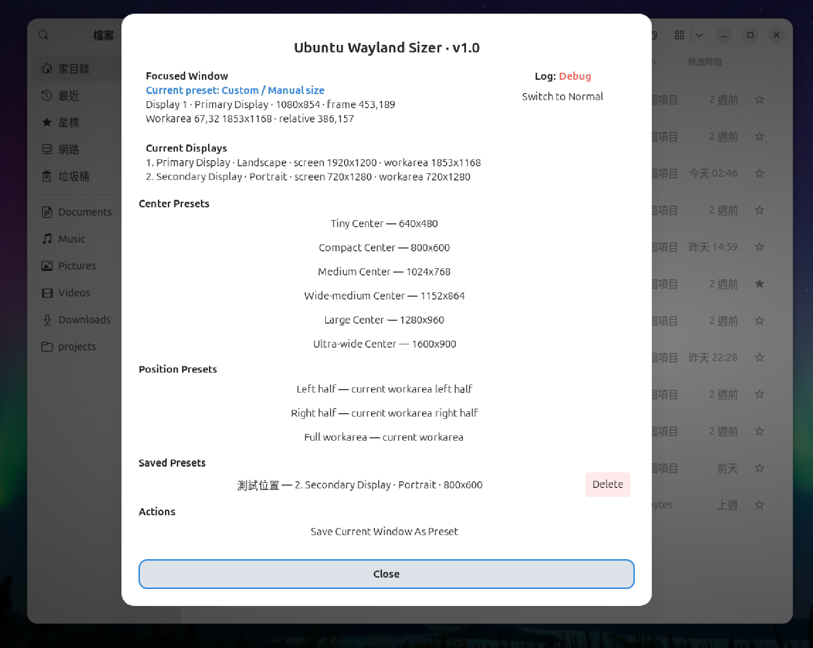

# Ubuntu Wayland Sizer

Ubuntu Wayland Sizer is a lightweight GNOME Shell extension for resizing and positioning the focused window on Ubuntu GNOME Wayland.

It provides Sizer-style presets for GNOME Shell / Mutter environments where traditional X11-style window sizing tools are no longer directly applicable.

## Why This Exists

Classic window-sizing tools such as Sizer were designed around window-management models that do not map cleanly to modern GNOME Wayland sessions.

On GNOME Shell + Wayland + Mutter, reliable window resizing needs to respect:

```text
- monitor workareas
- GNOME top bar / dock reservations
- mixed scaling
- multi-monitor layouts
- portrait monitors
- maximized or full-workarea-like windows
- application minimum-size constraints
```

Ubuntu Wayland Sizer focuses on doing a small set of window-sizing actions reliably inside GNOME Shell instead of trying to become a full tiling window manager.

## Features

Current baseline features:

```text
- resize and position the currently focused window
- left half / right half / full workarea presets
- expanded center preset library
- center preset cycling
- popup preset selector
- saved custom presets
- save/delete preset popup flows
- debug logging toggle from popup
- version visibility in popup title
```

Wayland / Mutter behavior support:

```text
- workarea-based geometry
- full-workarea / maximized-like breakout before resizing
- safe restore before applying target presets
- post-resize readback and correction
- Electron / minimum-width constrained app correction
- multi-monitor handling
- mixed-scaling smoke-tested behavior
- portrait-right monitor support
```

## Supported Environment

Primary validated target:

```text
Ubuntu 26.04
GNOME Shell 50
Wayland session
User-local GNOME Shell extension install
```

Validated display scenarios:

```text
- primary landscape monitor
- secondary portrait-right monitor
- 100% + 100%
- 125% + 125%
- 150% + 150%
- 100% + 125%
- 100% + 150%
```

Other GNOME Shell versions may require API or behavior adjustments.

Check your environment:

```bash
gnome-shell --version
echo $XDG_SESSION_TYPE
```

Expected session type:

```text
wayland
```

## Screenshots

### Popup Overview

Main popup with:

- Center Presets
- Position Presets
- Saved Presets
- runtime actions
- popup version visibility



## Default Shortcuts

```text
Super + Alt + H      -> Left half
Super + Alt + L      -> Right half
Super + Alt + F      -> Full workarea
Super + Alt + C      -> Wide-medium Center
Super + Alt + J      -> Compact Center
Super + Alt + K      -> Large Center
Super + Alt + .      -> Cycle center next
Super + Alt + ,      -> Cycle center previous
Super + Alt + Space  -> Open preset popup
```

Arrow-key defaults are intentionally avoided because Ubuntu/GNOME may intercept `Super + Alt + Arrow` combinations for built-in window-management behavior.

## Center Presets

Current built-in Center Presets:

```text
Tiny Center         -> 640x480
Compact Center      -> 800x600
Medium Center       -> 1024x768
Wide-medium Center  -> 1152x864
Large Center        -> 1280x960
Ultra-wide Center   -> 1600x900
```

On narrow portrait monitors, some center presets may be clamped to the available workarea width.

## Install for Development

Clone the repository:

```bash
git clone git@github.com:sawaichi9527/ubuntu-wayland-sizer.git
cd ubuntu-wayland-sizer
```

Install or update the user-local extension:

```bash
./scripts/install-extension-dev.sh
```

Enable the extension:

```bash
gnome-extensions enable ubuntu-wayland-sizer@sawaichi9527
```

Check status:

```bash
gnome-extensions info ubuntu-wayland-sizer@sawaichi9527
```

Expected state:

```text
狀態: ACTIVE
```

Open the popup:

```text
Super + Alt + Space
```

## Update Existing Development Install

```bash
git pull
./scripts/install-extension-dev.sh

gnome-extensions disable ubuntu-wayland-sizer@sawaichi9527
sleep 1
gnome-extensions enable ubuntu-wayland-sizer@sawaichi9527
```

If behavior appears stale after JavaScript changes, log out and log back in.

GNOME Shell / GJS may keep module state alive during development, so a full logout/login is the safest way to clear stale extension state.

## Watch Logs

```bash
journalctl --user -f -o cat /usr/bin/gnome-shell | grep ubuntu-wayland-sizer
```

Important log levels:

```text
NORMAL    user-visible operation result or runtime mode change
DEBUG     geometry trace, inference, popup lifecycle details
WARNING   recoverable anomaly; correction or fallback happened
CRITICAL  real failure; feature may not work
```

## Known Limitations

Current known limitations:

```text
- local/dev installs are not published on extensions.gnome.org
- Extension Manager View Details may show an error for local/dev installs
- update check may show Not Found for local/dev installs
- no GTK settings application
- no D-Bus service
- no panel indicator
- no gettext/i18n runtime integration yet
```

The Extension Manager detail-page error and update-check `Not Found` warning are expected for the current local development baseline.

## Design Principles

Ubuntu Wayland Sizer intentionally stays small.

Core principles:

```text
- remain a GNOME Shell extension only
- resize the focused window only
- use GNOME Shell keybindings
- use monitor workarea, not raw monitor geometry
- avoid becoming a full tiling window manager
- avoid background daemons and D-Bus services
- keep protected Wayland / Mutter workaround paths stable
```

Protected core behavior:

```text
- workarea-based geometry
- full-workarea / maximized-like detection
- safe restore before resizing
- delayed resize after Mutter state transition
- post-resize readback and correction
- Electron / minimum-width constrained app edge correction
- mixed-scaling and multi-monitor handling
```

These are compatibility-critical for GNOME Shell 50 + Wayland + Mutter.

## Repository Layout

```text
ubuntu-wayland-sizer/
├── README.md
├── CHANGELOG.md
├── docs/
├── extension/
│   ├── extension.js
│   ├── metadata.json
│   └── schemas/
│       └── org.gnome.shell.extensions.ubuntu-wayland-sizer.gschema.xml
└── scripts/
    └── install-extension-dev.sh
```

## Documentation Map

Key documents:

```text
docs/status.md
docs/deployment-quick-reference.md
docs/phase-7-5a-roadmap-and-guardrails.md
docs/phase-7-5c-deployment-and-troubleshooting.md
docs/phase-7-5d-ux-wording-polish.md
docs/phase-7-5e-i18n-ready-notes.md
```

Useful topic docs:

```text
docs/keybinding-policy.md
docs/known-issues.md
docs/test-matrix.md
docs/reference-implementations.md
```

## Release Status

Current state:

```text
Phase 7.6 — release packaging and public-facing preparation
```

Recent completed milestone:

```text
Phase 7.5 — release-readiness baseline
```

Phase 7.5 completed:

```text
- roadmap and protected-core guardrails
- version visibility
- deployment and troubleshooting docs
- UX wording polish
- i18n-ready notes
```

Next release-packaging work:

```text
- README hardening
- screenshots / GIF assets
- release ZIP flow
- extensions.gnome.org preparation notes
- compatibility matrix
- known limitations cleanup
```

## Project Scope

Ubuntu Wayland Sizer is not intended to replace a tiling window manager.

It is focused on:

```text
simple, reliable, preset-based window sizing for Ubuntu GNOME Wayland
```

## License

Ubuntu Wayland Sizer is released under the MIT License.

See [LICENSE](LICENSE) for details.
